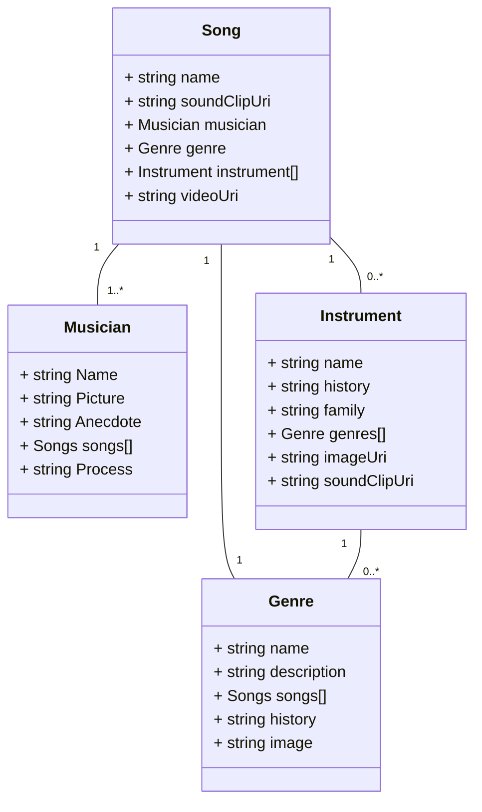

This is my term project from CS290 Web Development. I completed this project with three other students (Nina Turney, Yifei Zhao, and Sophia Liu).
We used Github for both source control and project management. I also used a google doc to keep track of meeting notes and brainstorming. I've linked the document below:

https://docs.google.com/document/d/1HSGYUsgJcubvtRpu8RelQNlYKIowSoGIGLC2T2jS1LA/edit?pli=1

# Project Documentation
Object UML Diagram:

Relationships:

Instrument:
* Each instrument has a few genres
    * Relationship stored on Instrument side
    * When an instrument is deleted, Genre is updated with Nothing
* An instrument has many songs
    * Relationship stored on Song side
    * When an instrument is deleted, Song is updated with Clear
	
Genre:
* Each genre has many songs 
     * Relationship stored on Song side.
    * When a Genre is deleted, Song is updated with Clear
* Each genre has many instruments
    * Relationship stored on Instrument side
    * When a genre is deleted, Instrument is updated with Clear

Musician:
* Each musician has many songs:
    * Relationship stored on Song side.
    * When a Musician is deleted, Song is updated with Cascade

Song:
* Each song has one musician
    * Relationship is stored on the Song side
    * When a song is deleted, update Musician with Nothing
* Each song has a one genres
    * Relationship stored on Song side
    * When a song is deleted, update Genre with Nothing
* Each song has a few instruments
    * Relationship stored on Song side
    * When a song is deleted, update Instrument with Nothing

Github project track link (also can be seen top bar as 'projects')
https://github.com/orgs/ChemeketaCS/projects/22/views/1
