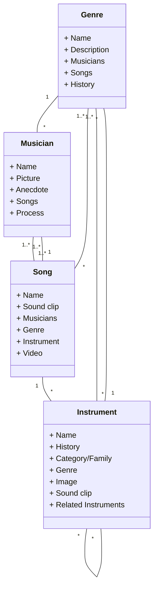

This is William's test ReadMe file.
This is CS290 Group 2's main repo 😸
It will contain our basic information and code
We have another google doc📄 for discussing and Github project page💻 for project tracking

Wk4 Update: Made an temporary gitignore
    Will be working on our Mermaid Diagram

# Project Documentation
Here are our proposed data types:

Relationships Descriptions:

Instrument Relationship:
* Each instrument has many genres (aggregation)
* Each instrument is related to many other instruments (aggregation)

Genre Relationship:
* Each genre has one to many musicians
* Each genre has many to many songs
* Each genre has many to many instruments

Musician Relationship:
* 1 or many musicians has 1 or many songs

Teammates Contact:
(william) Yifei Zhao
yzhao7@my.chemeketa.edu
Nina
nturney@chemeketa.edu
Sophia Liu
sophiayfliu@gmail.com
Travis
tkuenz20@my.chemeketa.edu

Google doc link:
https://docs.google.com/document/d/1HSGYUsgJcubvtRpu8RelQNlYKIowSoGIGLC2T2jS1LA/edit?pli=1
Github project track link (also can be seen top bar as 'projects')
https://github.com/orgs/ChemeketaCS/projects/22/views/1
Sophia's Final project ideas page:
https://docs.google.com/document/d/1RaGtYDZ_dPJ0JbQ883z3_zTJDKY0bGpSdCKCP5NRS_A/edit
