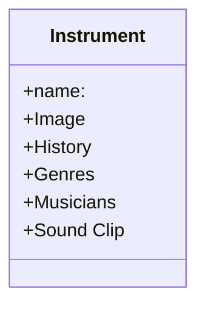

This is William's test ReadMe file.
This is CS290 Group 2's main repo 😸
It will contain our basic information and code
We have another google doc📄 for discussing and Github project page💻 for project tracking

Wk4 Update: Made an temporary gitignore
    Will be working on our Mermaid Diagram

WK3 Update:
Set up a /gitignore
Make a mermaid diagram for datatypes
try create some conflics and practice mergins
(Apr15 Monday) William, Nina, Travis, and Sophia decided on topic, data types, and whose responsibility for owning each data type. 
(Apr17 Wednesday) Sophia sent Andrew an email with a list of team 2 data types.

Travis's Class Chart:

Genre (by Nina)
    description 
    artists
    songs
    history
Song (by Yifei(William))
    sound clip
    artist/composer
    genre
    instrument
    video
Musician (by Sophia)
    pictures
    anecdotes
    songs
    process

WK2 Update(Apr10 after class)
William, Nina, Travis will meet tmr Thursday 1230
Next WK3 wendsday, we would give Andrew our sample complex data type as he requires.
Please see around.

Teammates Contact
(william) Yifei Zhao
yzhao7@my.chemeketa.edu
Nina
nturney@chemeketa.edu
Sophia Liu
sophiayfliu@gmail.com
Travis
tkuenz20@my.chemeketa.edu

google doc link:
https://docs.google.com/document/d/1HSGYUsgJcubvtRpu8RelQNlYKIowSoGIGLC2T2jS1LA/edit?pli=1
Github project track link (also can be seen top bar as 'projects')
https://github.com/orgs/ChemeketaCS/projects/22/views/1
Sophia's Final project ideas page:
https://docs.google.com/document/d/1RaGtYDZ_dPJ0JbQ883z3_zTJDKY0bGpSdCKCP5NRS_A/edit
