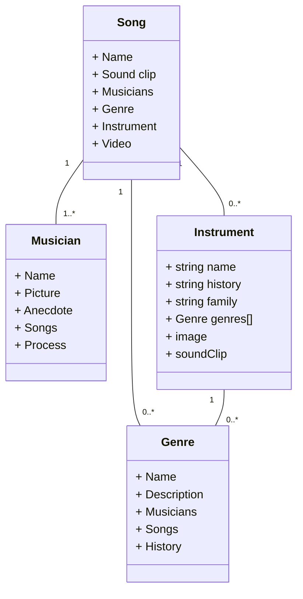

This is William's test ReadMe file.
This is CS290 Group 2's main repo 😸
It will contain our basic information and code
We have another google doc📄 for discussing and Github project page💻 for project tracking

Wk4 Update: Made an temporary gitignore
    Will be working on our Mermaid Diagram

# Project Documentation
Here are our proposed data types:

Relationships:

Instrument:
* Each instrument has a few genres
    * Relationship stored on Instrument side
    * When an instrument is deleted, Genre is updated with Nothing
* An instrument has many songs
    * Relationship stored on Song side
    * When an instrument is deleted, Song is updated with Clear
	
Genre:
* Each genre has many songs 
     * Relationship stored on Song side.
    * When a Genre is deleted, Song is updated with Clear
* Each genre has many instruments
    * Relationship stored on Instrument side
    * When a genre is deleted, Instrument is updated with Clear

Musician:
* Each musician has many songs:
    * Relationship stored on Song side.
    * When a Musician is deleted, Song is updated with Cascade

Song:
* Each song has one musician
    * Relationship is stored on the Song side
    * When a song is deleted, update Musician with Nothing
* Each song has a few genres
    * Relationship stored on Song side
    * When a song is deleted, update Genre with Nothing
* Each song has a few instruments
    * Relationship stored on Song side
    * When a song is deleted, update Instrument with Nothing

Teammates Contact:
(william) Yifei Zhao
yzhao7@my.chemeketa.edu
Nina
nturney@chemeketa.edu
Sophia Liu
sophiayfliu@gmail.com
Travis
tkuenz20@my.chemeketa.edu

Google doc link:
https://docs.google.com/document/d/1HSGYUsgJcubvtRpu8RelQNlYKIowSoGIGLC2T2jS1LA/edit?pli=1
Github project track link (also can be seen top bar as 'projects')
https://github.com/orgs/ChemeketaCS/projects/22/views/1
Sophia's Final project ideas page:
https://docs.google.com/document/d/1RaGtYDZ_dPJ0JbQ883z3_zTJDKY0bGpSdCKCP5NRS_A/edit
